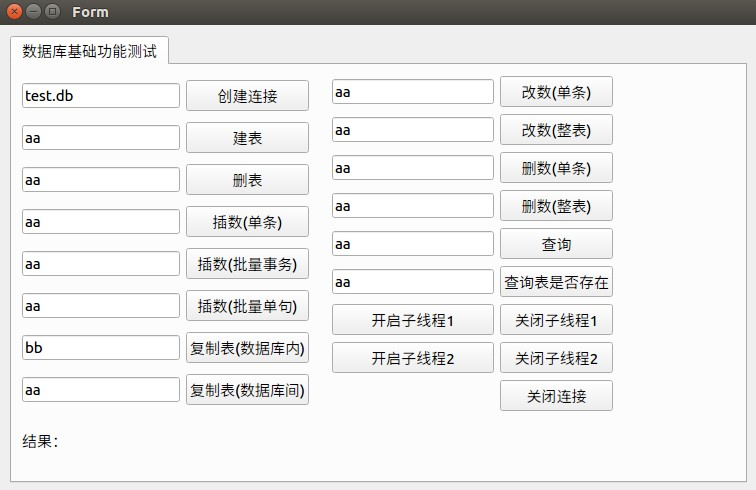

# DatabaseManager
这是一个使用Qt封装的针对SQLite3的数据库基础操作组件。
## 功能概述:
该组件基于Qt SQL模块(主要使用接口层的一些类QSqlDatabase、QSqlQuery)，针对SQLite3数据库基础操作以及特色功能进行封装,提供一些常用的数据库SQL操作的接口。  
DatabaseManager类的主要功能就是将各操作的SQL命令封装到接口函数中，开发者在需要操作数据库时，只需调用接口即可，而不需要在代码各处写SQL命令，便于程序的维护。同时为了处理SQLite3的多线程访问问题，该基类中也提供了读写锁控制，可以根据实际应用的情况选择是否打开(如果使用复制表的接口则必须打开)。  
注：该组件主要针对单数据库的管理而设计，对于多数据库管理，需要定义多个对象实现。有关该组件的具体功能详见代码及注释。  
## 运行截图:
在项目目录下，主要使用DatabaseManager类(databasemanager.h,databasemanager.cpp)提供数据库的管理，其他的均是用来测试该类接口功能的辅助文件，具体涵盖的测试接口如下图所示。  
  
## 小结:
其实在Qt SQL模块中提供了执行SQL语句的接口方法，可以直接使用。不过为了便于我们项目代码的后期维护，尽量使各功能模块保持独立性，降低耦合程度。所以编写了该组件，在Qt SQL模块之上对数据库的基础操作进一步的封装，将所有的SQL语句的执行全部内聚在一个模块中，提供各操作的接口方法。这种方式相对而言会有些许的性能损失（多一层封装），但可以降低代码的复杂度，提高程序的稳定性。
## 作者联系方式
**邮箱:justdoit_mqr@163.com**  
**新浪微博:@为-何-而来**  
